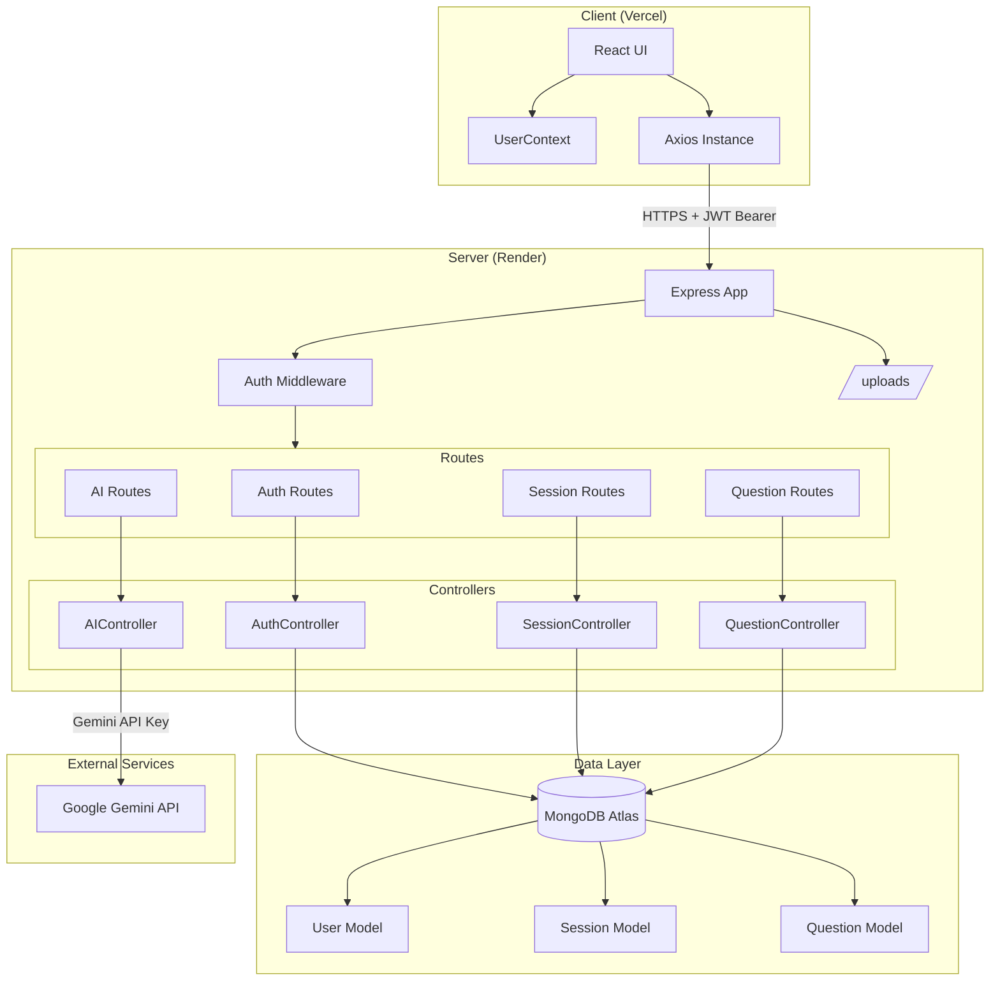
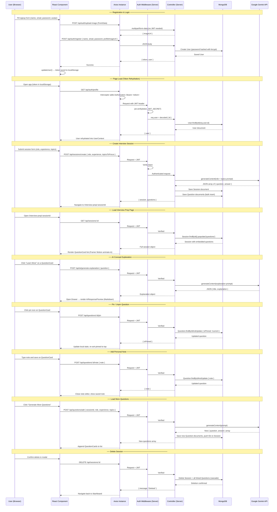
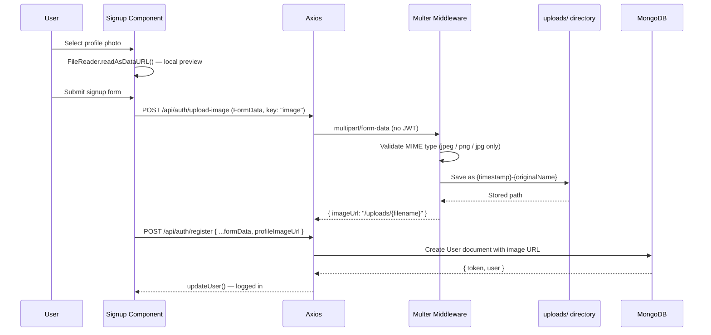

# Client — AI-Powered Interview Platform

React 19 single-page application built with Vite. Handles authentication, session management, AI-generated interview Q&A, and concept explanations powered by Google Gemini.

## Tech Stack

| Concern | Library / Version |
|---|---|
| Framework | React 19.1, Vite 7 |
| Language | JavaScript (ES2022+) |
| Styling | Tailwind CSS 4, Framer Motion 12 |
| Routing | React Router DOM 7 |
| HTTP Client | Axios 1.11 |
| Markdown Rendering | react-markdown, react-syntax-highlighter |
| Notifications | react-hot-toast |
| Date Formatting | Moment.js |

## Project Structure

```
client/
├── src/
│   ├── pages/
│   │   ├── LandingPage.jsx              # Public homepage with auth modal
│   │   ├── Auth/
│   │   │   ├── Login.jsx                # Login form
│   │   │   └── Signup.jsx               # Signup form + avatar upload
│   │   ├── Home/
│   │   │   ├── Dashboard.jsx            # User's session list
│   │   │   └── CreateSessionForm.jsx    # New session form (role, exp, topics)
│   │   └── InterviewPrep/
│   │       ├── InterviewPrep.jsx        # Question list for a session
│   │       └── components/
│   │           ├── AIResponsePreview.jsx  # Renders Gemini explanation
│   │           └── RoleInfoHeader.jsx     # Session metadata header
│   │
│   ├── components/
│   │   ├── Cards/
│   │   │   ├── QuestionCard.jsx         # Expandable Q&A + pin/note/learn
│   │   │   ├── ProfileInfoCard.jsx      # User info in nav
│   │   │   └── SummaryCard.jsx          # Session card on dashboard
│   │   ├── Inputs/
│   │   │   ├── Input.jsx                # Styled text input
│   │   │   └── ProfilePhotoSelector.jsx # Image picker with preview
│   │   ├── Loader/
│   │   │   ├── SkeletonLoader.jsx       # Question placeholder
│   │   │   └── SpinnerLoader.jsx        # Generic spinner
│   │   ├── layouts/
│   │   │   ├── DashboardLayout.jsx      # Sidebar + main area wrapper
│   │   │   └── Navbar.jsx               # Top navigation bar
│   │   ├── Modal.jsx                    # Generic modal
│   │   ├── Drawer.jsx                   # Slide-in panel (notes/explanations)
│   │   └── DeleteAlertContent.jsx       # Confirm-delete dialog
│   │
│   ├── context/
│   │   └── userContext.jsx              # Global auth state
│   │
│   ├── utils/
│   │   ├── axiosInstance.js             # Configured Axios + JWT interceptors
│   │   ├── apiPaths.js                  # Centralized API endpoint constants
│   │   ├── helper.js                    # Utility functions
│   │   ├── uploadImage.js               # Profile image upload helper
│   │   └── data.js                      # Static data (role options, etc.)
│   │
│   ├── App.jsx                          # Route definitions
│   └── main.jsx                         # Entry point
│
├── public/
├── Dockerfile
├── vite.config.js
└── package.json
```

## Routing

| Path | Component | Auth Required |
|---|---|---|
| `/` | `LandingPage` | No |
| `/dashboard` | `Dashboard` | Yes — redirects to `/` if no user |
| `/interview-prep/:sessionId` | `InterviewPrep` | Yes — redirects to `/` if no user |

## Global State — UserContext

`UserContext` wraps the entire application and exposes three values:

```js
{
  user: null | { _id, name, email, profileImageUrl },
  loading: boolean,
  updateUser(userData): void,  // saves user + JWT to localStorage
  clearUser(): void            // logout — wipes localStorage
}
```

On mount, if a JWT token exists in `localStorage`, the context calls `GET /api/auth/profile` to rehydrate the user object without requiring a new login.

## HTTP Client — Axios Instance

`src/utils/axiosInstance.js` pre-configures every outgoing request:

```js
baseURL: 'https://interview-platform-backend-uawb.onrender.com/'
timeout: 80000   // 80 s — Gemini generation can be slow
headers: { 'Content-Type': 'application/json' }
```

**Request interceptor** attaches the JWT bearer token automatically:

```js
config.headers.Authorization = `Bearer ${localStorage.getItem('token')}`
```

**Response interceptor** handles errors centrally:

- `401 Unauthorized` → clears user state, redirects to `/`
- `500 Server Error` → logs the server error message
- Network/timeout error → logs a timeout notice

---

## System Architecture




## Client ↔ Server Interaction

### Full Application Flow



### Profile Photo Upload Flow



---

## Key Component Behaviours

### QuestionCard

- Collapsed by default; click to expand answer
- **Pin** — toggles `isPinned`, pinned cards sort to top
- **Note** — inline editor that saves to the server on blur/submit
- **Learn More** — triggers Gemini explanation, opens Drawer with markdown-rendered content

### Dashboard

- Lists all sessions as `SummaryCard` tiles
- "+" button opens `CreateSessionForm` in a Modal
- Each tile links to `/interview-prep/:sessionId`

### InterviewPrep

- Fetches session + questions on mount
- Skeleton loaders shown during fetch/generation
- `RoleInfoHeader` displays role, experience, topics
- Framer Motion stagger animation for card list

---

## Environment

For local development, update the `baseURL` in `src/utils/axiosInstance.js`:

```js
baseURL: 'http://localhost:8000'
```

## Scripts

```bash
npm install       # install dependencies
npm run dev       # start dev server at http://localhost:5173
npm run build     # production build → dist/
npm run preview   # preview production build locally
npm run lint      # run ESLint
```

## Docker

```bash
# Build image
docker build -t interview-client .

# Run
docker run -p 5173:5173 interview-client
```

Or use Docker Compose from the repo root — see the root [README](../README.md) for the compose file.
